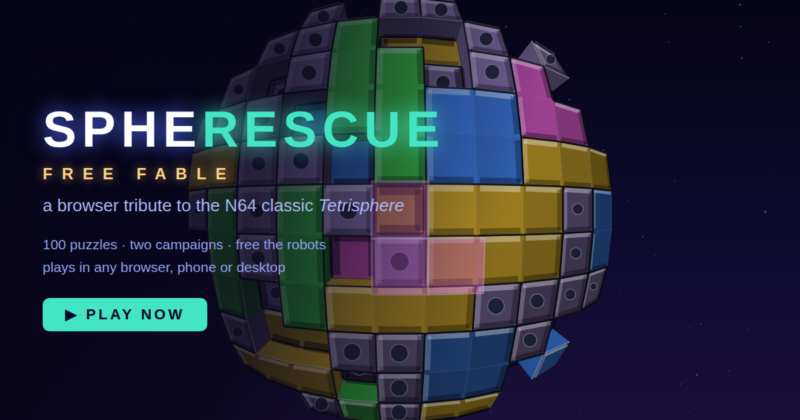

# Spherescue: Free Fable



A browser tribute to **Tetrisphere** (H2O Entertainment / Nintendo, N64, 1997) —
rebuilt from scratch in plain JavaScript with no dependencies, no build step,
and original art and music. Open `index.html` and play — desktop keyboard,
gamepad, or a touch interface that appears automatically on phones and
tablets. Gameplay feel was tuned frame-by-frame against footage of the
original hardware.

This is a ground-up reimplementation of the game's mechanics, not an
emulator: no ROM, no ripped assets. MIT licensed.

## Play

Serve the folder (or just open the file):

```sh
python3 -m http.server 8000
# → http://localhost:8000
```

### Controls

| Action | Keyboard | Gamepad | Touch |
|---|---|---|---|
| Move / scroll sphere | Arrows / WASD | D-pad or stick | joystick (small pull = one step, further = faster) or swipe the sphere |
| Drop piece | Space / Z / Enter | A | DROP button |
| Grab & drag piece (hold) | Shift / X | B (hold) | hold GRAB + joystick |
| Fire magic | C | X | — |
| Reset puzzle | R | Y | — |
| Pause | Esc / P | Start | — |
| Music on/off | M | — | — |

## How it works (like the original did)

The "sphere" is a lie the original told too: the playfield is a **32×32 grid
that wraps in both directions** (a torus), drawn with an azimuthal fisheye
projection so it reads as a planet you can scroll around forever. Pieces
stack in up to 8 layers over a core.

Faithful rules implemented:

- **Six piece shapes, no rotation** — yellow and green 3-bars (horizontal vs
  vertical are *different pieces*), pink L, blue 2×2 square, red T, cyan Z.
  Grey 1×1 **crystals** pad the gaps.
- **Strict vs loose matching** — squares and bars only count as touching on
  full flush side contact; L, T and Z touch on any edge. Exactly-stacked
  same-type pieces connect vertically, so chains eat down through layers.
- **Drops must combo** — the dropped piece has to join at least two of its
  kind or you lose one of three hearts, your X-Count, and any held magic.
- **Grab & slide** — hold grab over a piece shaped like your current piece to
  drag it. Slides plow through crystals, stop at real pieces, and pieces
  that lose support fall; a fallen piece landing against two like pieces
  clears for free (**gravity combo**).
- **Speed meter** — drains blue → yellow → red while you dither, the camera
  zooming in until the piece force-drops.
- **Power pieces & magic** — every clear showers sparks that turn pieces
  glowy (10× points, X-Count fuel, they can climb layers while dragged; you
  can also forge one by grabbing a crystal patch shaped like your piece).
  Big clears earn the magic ladder: Firecracker → Dynamite → Magnet → Atom →
  Bomb → Ray Gun, fired with C.
- **Wild "?" pieces** morph through every shape — drop at the right moment.

## Modes

- **Free Fable** — a 22-level campaign that frees an animated character
  for every Claude model, ordered by capability from Claude Instant up to
  **Fable 5** (sunburst sparks, sunburst-headed figures, and a pixel
  Clawd). Boards are seeded, patterned digs ramping in depth, piece
  variety, and speed; exposing a core section restores a heart. Every
  playable level is machine-verified solvable using only real game moves.
  The final level holds **Mythos 5** behind an unbroken crystal shell
  that — provably, under the game's own rules — cannot be breached.
- **Rescue** — the classic campaign: expose the required number of 2×2
  core sections to free the robot. Ten episodes of ten levels with more
  layers, more piece types, and a faster meter as you go.
- **Puzzle** — **100 levels**, every one verified solvable within its
  exact budget of **drags** and **drops**; clear *everything*, R to
  reset. A five-level tutorial, then difficulty and required moves rise
  monotonically to level 100. Levels are layered digs: buried pairs
  under stacks that must be dismantled piece by piece into gravity
  clears. Most drops are wild; **set order** levels deal a fixed queue
  of shapes instead (there, grabs are free). Picture levels (smileys,
  stars, a certain crab) punctuate the climb.
- **Time Trial** — five minutes, maximum score, core sections worth 3×.

A **difficulty setting** on the main menu (easy / medium / hard) changes
one thing only: how many seconds the speed meter gives you per piece.
Records remember the difficulty they were earned on — a lower-difficulty
run never displaces a higher one.

Progress auto-saves in the browser, records your best score and fewest
pieces per level, and can be carried between devices with a **save code**
(main menu → SAVE CODE).

## Code map

| File | What it is |
|---|---|
| `js/engine.js` | Torus grid, pieces, stacking, slide/drop/settle, match rules |
| `js/render.js` | Canvas 2D fisheye "sphere" projection, blocks, core, starfield |
| `js/game.js` | Modes, combos, sparks/power/magic, speed meter, HUD |
| `js/levels.js` | Rescue sphere generator + hand-authored puzzles (solutions in comments) |
| `js/freefable.js` | Free Fable campaign: seeded boards, model roster, robot art |
| `js/input.js` | Keyboard, gamepad, touch |
| `js/audio.js` | WebAudio sequencer — original techno groove + synth SFX |
| `js/main.js` | Menus and the main loop |

Mechanics were reconstructed from public documentation of the original
(manual text, tetris.wiki, Hard Drop wiki, GameFAQs guides, reviews).
The soundtrack is an original composition in the spirit of Neil Voss's
celebrated score; no assets were taken from the game or its emulation.
